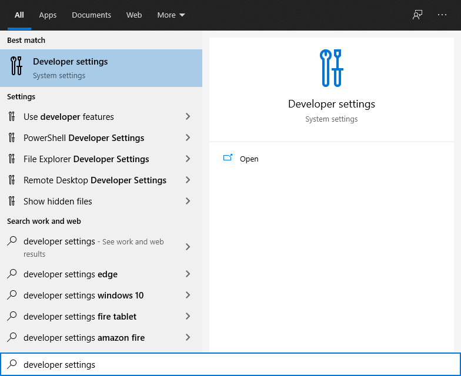
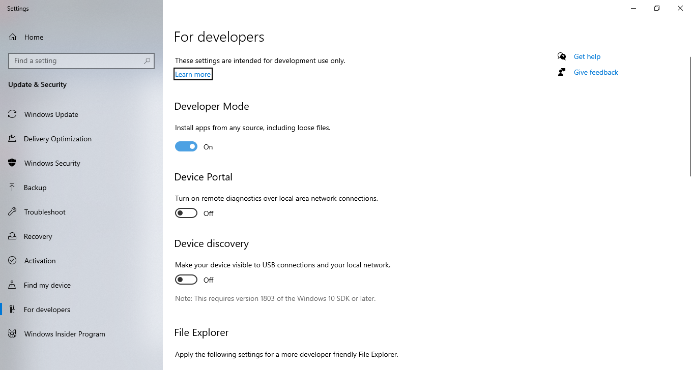

# End to end tests (Smoke tests)

Smoke tests can be run against any deployed version of a proxy, follow the [setup and install](#setup) to get started.

Once setup see:

**[Add a new example](./docs/AddingExamples.md)**

**[Running smoke tests on Windows](./docs/WindowsTesting.md)**

**[Testing with dispensers on Windows](./docs/WindowsTestingDispensing.md)**

**[Generating postman collections on Windows](./docs/WindowsPostman.md)**

## Setup

### Download

Turn on developer mode *before* cloning repo to allow windows to create symlinks used in repo. See below:

  
  

Save to C://e to avoid long path issue in windows when running smoke-tests (was not resolved by setting to 1 in registry during testing). See below:

```
cd C://
git clone https://github.com/NHSDigital/electronic-prescription-service-api.git e
```

### Install 

Tested on node version: v14.15.4

```
cd C://e
. .\make.ps1 # *see note below
make install-smoke-tests
```

---

**Note:** you can add full path to profile by running "notepad $profile" and adding ". C://e/make.ps1" so it doesn't need to be run every time you open a new powershell window

---

### Configuration

You will need to put the following variables in `envrc.ps1` in repo root, ask nimbus dev team for the values:

```
$env:PACT_BROKER_URL=
$env:PACT_BROKER_BASIC_AUTH_USERNAME=
$env:PACT_BROKER_BASIC_AUTH_PASSWORD=
```